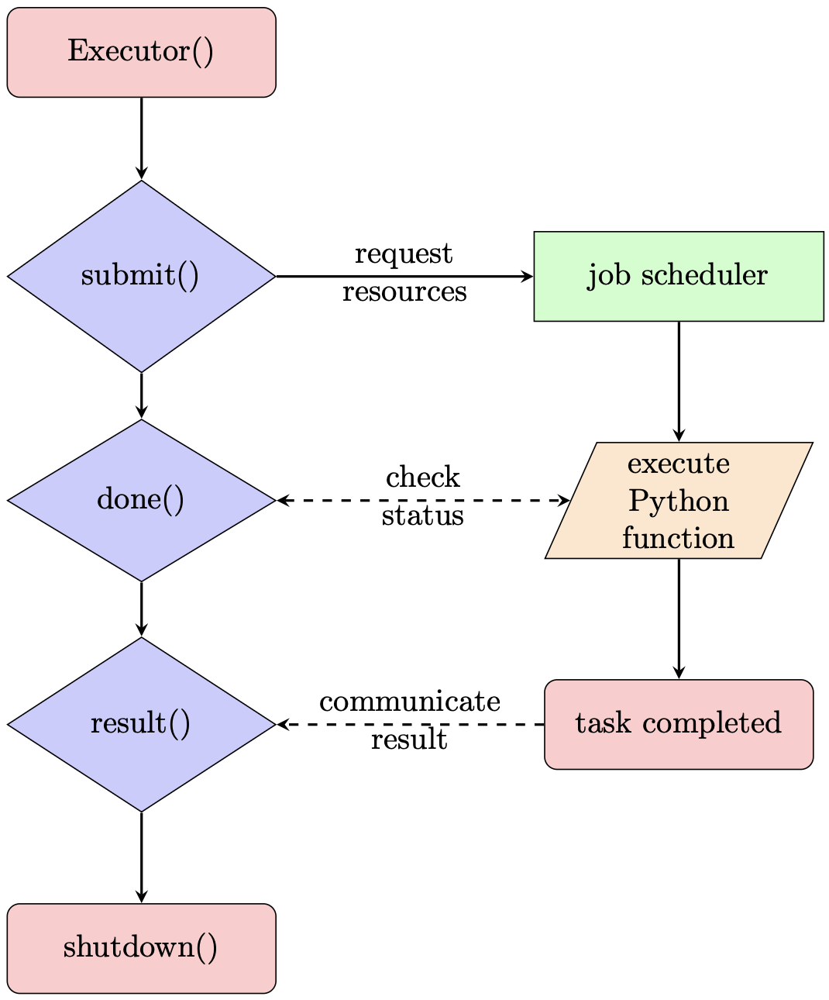

# Summary
Executorlib enables the execution of hierarchical Python workflows on heterogenous computing resources of high-performance computing (HPC) clusters. This is achieved by extending the Executor class of the Python standard library for asynchronously executing callables with an interface to HPC job schedulers. The initial release of Executorlib supports the Simple Linux Utility for Resource Management (SLURM) and the flux framework as HPC job schedulers to start Python processes with dedicated computing resources such as CPU cores, memory or accelerators like GPUs. For heterogenous workflows, Executorlib enables the use of parallel computing frameworks like the message passing interface (MPI) or of dedicated GPU libraries on a per workflow step basis. Python workflows can be up-scaled with Executorlib from a laptop up to the latest Exascale HPC clusters with minimal code changes including support for hierarchical workflows. Finally, Executorlib provides several utility functions to accelerate the rapid prototyping of Python workflows, like the caching of intermediate results, the visualization of the workflow graph and the tracking of execution time, enabling fast and agile development.

# Statement of Need
The convergence of artificial intelligence (AI) and high-performance computing (HPC) workflows [@workflows] is one of the key drivers for the rise of Python workflows for HPC. Previously, the Python programming language was primarily used in scientific HPC workloads to couple performance-critical scientific software packages written in different programming languages in order to solve complex tasks. To avoid intrusive code changes, interfaces to performance critical scientific software packages were traditionally implemented using file-based communication and control shell scripts, leading to poor maintainability, portability, and scalability. This approach is however losing ground to more efficient alternatives, such as the use of direct Python bindings, as their support is now increasingly common in scientific software packages and especially machine learning packages and AI frameworks. This enables the programmer to easily express complex workloads that require the orchestration of multiple codes. Still, Python workflows for HPC also come with challenges, like (1) safely terminating Python processes, (2) controlling the resources of Python processes and (3) the management of Python environments [@pythonhpc]. The first two of these challenges can be addressed by developing strategies and tools to interface HPC job schedulers like the SLURM [@slurm] with Python in order to control the execution and manage the computational resources required to execute heterogenous HPC workflows. 

We distinguish two main use cases for such interfaces: either to request a separate queuing system allocation from the job scheduler for each workflow step or to internally allocate computing resources to individual (sub-)tasks within an existing queuing system allocation. In the context of the SLURM job scheduler, these differences are distinguished by the `sbatch` and `srun` command. A number of Python workflow frameworks have been developed for both types of interfaces, ranging from domain-specific solutions for fields like high-throughput screening in computational materials science [@fireworks; @aiida; @pyiron], to generalized Python interfaces for job schedulers [@myqueue; @psij] and task scheduling frameworks which implement their own task scheduling on top of the HPC job scheduler [@dask; @parsl; @jobflow]. While these tools can be powerful, they introduce new constructs that are not familiar to most Python developers, introducing complexity and a barrier to entry. To address this limitation while at the same time leveraging the powerful novel hierarchical HPC resource managers like the flux framework [@flux], we introduce Executorlib, which instead leverages and naturally extends the familiar Executor interface defined by the Python standard library from single-node shared-memory operation to multi-node distributed operation on HPC platforms. In doing so, Executorlib enables the rapid development, prototyping, and deployment of heterogenous HPC workflows using only familiar and easy to maintain Python syntax, hence greatly simplifying the up-scaling of scientific workflows from laptops to very large computational scales. 

# Features and Implementation
Based on prior experience with the development of the pyiron workflow framework [@pyiron], the design philosophy of Executorlib is centered on the timeless principle of not reinventing the wheel. Rather than implementing its own job scheduler, Executorlib instead leverages existing job schedulers to request and manage Python processes and associated computing resources. Further, instead of defining a new syntax and concepts, Executorlib extends the existing syntax of the Executor class in the Python standard library. Taken together, this makes changing the mode of execution in Executorlib as easy as changing the Executor class, with the interface remaining the same. 

## Example
To illustrate the usage of Executorlib and explain the technical processes occurring in the background, we consider the simple example of doubling the numbers in the range from 1 to 4 on a laptop, local workstation or a single computing node of an HPC. With Executorlib, this can be achieved using the following code: 
```python
from executorlib import SingleNodeExecutor

with SingleNodeExecutor() as exe:
    future_lst = [exe.submit(sum, [i, i]) for i in range(1, 5)]
    print([fs.result() for fs in future_lst])
```
In this example, each individual summation is concurrently executed in a separate process. We note the strict adherence to the standard python Executor Interface as the example remains functional when the Executorlib Executor `SingleNodeExecutor()` object is replaced with either the `ThreadPoolExecutor` or the `ProcessPoolExecutor` from the Python standard library. Following the initialization of the Executor context with the with-statement, the summation function `sum` is submitted for execution with the argument `[i, i]`, generated from the for-loop iterating over the range 1 to 4. \autoref{fig:process} illustrates the internal functionality of Executorlib. The submission function `submit()` requests the computational resources from the job scheduler, which can be SLURM, flux or a local job scheduler, depending on the choice of Executor class. The Python function is then executed asynchronously in a newly created Python process. The user can interact with the asynchronously executing Python process on the right through the `concurrent.futures.Future` object returned from the submission function, again as defined by the Python standard library. In the code example above, the `concurrent.futures.Future` object is named `fs`.  The `concurrent.futures.Future` object offers a function to check the status of the Python process (`done()`) and a function to block the execution of the process on the left until the execution of the process on the right is completed (`result()`). In contrast to the standard objects however, the Executorlib Executor allows for execution across multiple nodes of HPC systems, which enables the execution of highly compute-intensive workloads that require extensive computational resources, as we now show.

{width="50%"}

## Job Schedulers
Currently, Executorlib supports five different job schedulers implement as different Executor classes. The first is the `SingleNodeExecutor` for rapid prototyping on a laptop or local workstation in a way that is functionally similar to the standard `ProcessPoolExecutor`. The second, `SlurmClusterExecutor` submits Python functions as individual jobs to a SLURM job scheduler using the `sbatch` command, which can be useful for long-running tasks, e.g., that call a compute intensive legacy code. This mode also has the advantage that all required hardware resources do not have to be secured prior to launching the workflow and can naturally vary in time. The third is the `SlurmJobExecutor` which distributes Python functions in an existing SLURM job using the `srun` command. It can be nested in a function submitted to a `SlurmClusterExecutor` to increase the computational efficiency for shorter tasks, as already requested computing resources are sub-divided rather than requesting new computing resources from the SLURM job scheduler. In analogy, the `FluxClusterExecutor` submits Python functions as individual jobs to a flux job scheduler and the `FluxJobExecutor` distributes Python functions in a flux job. Given the hierarchial approach of the flux scheduler there is no limit to the number of `FluxJobExecutor` instances which can be nested inside each other to construct hierarchical workflows. Finally, the `FluxJobExecutor` can also be nested in a `SlurmClusterExecutor` and is commonly more efficient than the `SlurmJobExecutor` as it uses the flux resource manager, rather than communicating with the central SLURM job scheduler using the `srun` command. While the `SlurmClusterExecutor` and the `FluxClusterExecutor` use file-based communication under the hood e.g., the Python function to execute and its inputs are stored on the file system, executed in a separate Python process whose output is again stored in a file, the other Executors rely on socket-based communication to improve computational efficiency. 

## Resource Assignment
To assign dedicated computing resources to individual Python functions, the Executorlib Executor classes extend the submission function `submit()` to support not only the Python function and its inputs, but also a Python dictionary specifying the requested computing resources `resource_dict`. The resource dictionary can define the number of compute cores, number of threads, number of GPUs, as well as job scheduler specific parameters like the working directory, maximum run time or the maximum memory. With this hierarchical approach, Executorlib allows the user to finely control the execution of each individual Python function, using parallel communication libraries like the Message Passing Interface (MPI) for Python [@mpi4py] or GPU-optimized libraries to aggressively optimize complex compute intensive tasks of heterogenous HPC that are best solved by tightly-coupled parallelization approaches, while offering a simple and easy to maintain approach to the orchestration of many such weakly-coupled tasks. This ability to seamlessly combine different programming models again accelerates the rapid prototyping of heterogenous HPC workflows without sacrificing performance of critical code components.

## Dependencies
While two inter-dependent Python functions with similar computational resource requirements can always be combined and executed as a single Python function, this is no longer the case for Python functions with dramatically different resource requirements. In this case Executorlib again extends the submission function `submit()` to support `concurrent.futures.Future` objects from the Python standard library as inputs. When such an argument is passed as input of a subsequent function, the Executor waits until the Python process linked to the `concurrent.futures.Future` object completes its execution, before submitting the dependent Python function for execution. In the case of the `SlurmClusterExecutor` and the `FluxClusterExecutor` which use file-based communication, the dependencies of the Python functions are communicated to the job scheduler, so the communication is decoupled from the initial Python process, which submitted the Python functions, as the execution can be delayed until the user receives access to the requested computing resources from the job scheduler. Finally, by enabling the plotting parameter `plot_dependency_graph=True` during the initialization of the Executorlib Executor classes, the resulting dependency graph can be visualized to validate the dependency relationships between the different `concurrent.futures.Future` objects. 

## Performance Optimization
While Executorlib is not a priori designed for Python functions with runtimes of less than about a minute, given the overhead of requesting dedicated computing resources and starting a new Python process, the execution of these functions can be significantly accelerated by reusing dedicated computing resources for the submission of multiple Python functions in the `SingleNodeExecutor`, `SlurmJobExecutor` or `FluxJobExecutor`. This is enabled by setting the block allocation parameter `block_allocation` during the initialization of the corresponding Executor class to `True`. Rather than starting a separate Python process for each submitted Python function, the block allocation mode starts a dedicated number of workers (with a fixed resource allocation over their lifetime) and then allows the user to submit Python functions to these pre-defined workers. To further improve computational efficiency when working with multiple analysis functions being applied on the same large dataset, data can be pre-loaded during the initialization of the Python function using the initialization function `init_function`. This initializes a Python dictionary in the Python process which is accessible by all subsequently submitted Python functions. 

## Caching
The development of a HPC workflow is commonly an iterative process, which means the initial steps are repeated multiple times until the workflow is fully developed. To accelerate this process, Executorlib provides the option to cache the output of previously evaluated Python functions so these outputs can be reloaded without the need for repeating the evaluation of the same potentially expensive Python functions. Caching in Executorlib uses the same file storage interface as for the file-based communication with the `SlurmClusterExecutor` or the `FluxClusterExecutor`. The caching is enabled by defining the cache directory parameter `cache_directory` as additional input during the initialization of the Executorlib Executor class. Finally, the cache also contains the execution time as additional information, enabling performance analysis of the workflow during the development cycle. 

## Advanced Example
To demonstrate the advanced functionality of Executorlib beyond the scope of the Executor interface of the Python standard library a second advanced example is provided. This advanced example requires the flux framework to be installed and started with at least one computing node in a given queuing system allocation and with at least one computing node having one GPU. At the moment the flux framework is only available for the GNU/Linux operating system, which is the operating system used by the majority of the HPC clusters, so the following example can only be executed on GNU/Linux. 
```python
from executorlib import FluxJobExecutor

def get_available_GPUs(ind, lst):
    import socket
    from tensorflow.python.client import device_lib
    local_device_protos = device_lib.list_local_devices()
    return [
        (ind, x.name, x.physical_device_desc, socket.gethostname()) 
        for x in local_device_protos if x.device_type == "GPU"
    ] + lst

with FluxJobExecutor() as exe:
    fs = []
    for i in range(1, 4):
        fs = exe.submit(
            get_available_GPUs,
            ind=i,
            lst=fs,
            resource_dict={"cores": 1, "gpus_per_core": 1},
        )
    print(fs.result())
```
By adding the resource dictionary parameter `resource_dict` in the submission function, each Python function receives a dedicated CPU core and a corresponding GPU for the execution of the submitted function. In the submitted function the `tensorflow` machine learning framework is imported to list the metadata of the available GPU. Furthermore, the submission is repeated three times with the output being aggregated in a joined list. For the aggregation of the output of the individual submissions, the previous information is stored in a `concurrent.futures.Future` object named `fs` and is provided as an input to the next function during submission. Consequently, the execution is limited to serial execution. The dependencies ase visualized in \autoref{fig:dependencies}. Alternatively, the results could be merged into one list after the submission of the individual functions, that would enable the parallel execution of the individual Python functions. 

{width="50%"}

# Usage To-Date 
While initially developed in the US DOE Exascale Computing Project’s Exascale Atomistic Capability for Accuracy, Length and Time (EXAALT) to accelerate the development of computational materials science simulation workflows for the Exascale, Executorlib has since been generalized to support a wide-range of backends and HPC clusters at different scales. Based on this generalization, it is also been implemented in the pyiron workflow framework [@pyiron] as primary task scheduling interface. 

# Additional Details 
This manuscript provides a general overview of the Executorlib package, the full documentation including a number of examples for the individual features is available at [executorlib.readthedocs.io](https://executorlib.readthedocs.io) and the corresponding source code at [github.com/pyiron/executorlib](https://github.com/pyiron/executorlib). Executorlib is developed an as open-source library with a focus on stability, which is achieved with an >95% test coverage, type hinting and a modular software design approach. 

# Acknowledgements
J.J. was supported by the Laboratory Directed Research and Development program of Los Alamos National Laboratory under project number 20220815PRD4. J.J. and D.P. acknowledge funding from the Exascale Computing Project (17-SC-20-SC), a collaborative effort of the U.S. Department of Energy Office of Science and the National Nuclear Security Administration, and the hospitality from the “Data-Driven Materials Informatics” program from the Institute of Mathematical and Statistical Innovation (IMSI). J.J. and J.N. acknowledge funding from the Deutsche Forschungsgemeinschaft (DFG) through the CRC1394 “Structural and Chemical Atomic Complexity – From Defect Phase Diagrams to Material Properties”, project ID 409476157. J.J., M.G.T., P.Y., J.N. and D.P. acknowledge the hospitality of the Institute of Pure and Applied math (IPAM) as part of the “New Mathematics for the Exascale: Applications to Materials Science” long program. M.G.T. and P.Y. acknowledge support of the U.S. Department of Energy (DOE), Office of Science, Office of Basic Energy Sciences, Heavy Element Chemistry Program (KC0302031) under contract number E3M2. Los Alamos National Laboratory is operated by Triad National Security LLC, for the National Nuclear Security administration of the U.S. DOE under Contract No. 89233218CNA0000001.

# References
